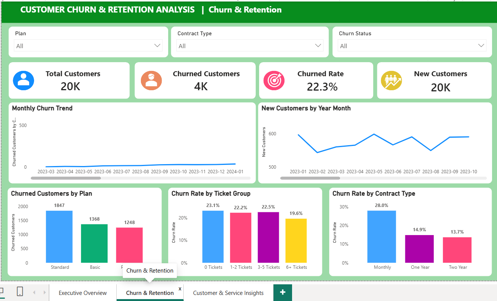

# Customer Churn & Retention Analysis

An end-to-end customer churn and retention analytics project built using
**Python, SQL, and Power BI**. The project follows a structured workflow
from raw data validation and cleaning through feature engineering, churn
analysis, business insights, retention recommendations, and interactive
dashboard reporting.

## 📊 Project at a Glance

  Metric                                Result
  --------------------------------- ----------
  Customers Analyzed                    20,000
  Churned Customers                      4,463
  Active Customers                      15,537
  Churn Rate                            22.32%
  Retention Rate                        77.69%
  Payment Transactions                 355,437
  Total Payment Amount                ₹205.96M
  Retention Recommendations                 40
  Multi-dimensional Opportunities           10

## 🎯 Business Objective

Customer churn can reduce recurring revenue and increase the cost of
acquiring replacement customers. This project analyzes customer,
subscription, payment, service, and support data to understand **where
churn is concentrated and which customer segments may require retention
attention**.

The analysis focuses on questions such as:

-   What is the overall customer churn rate?
-   Which contract types have higher observed churn?
-   How does churn vary across subscription plans?
-   What patterns exist across customer lifecycle and engagement?
-   How do payment and support experiences differ between active and
    churned customers?
-   Which customer segments represent potential retention opportunities?
-   How can the analysis be translated into actionable business
    recommendations?

> **Analytical note:** The findings in this project are descriptive and
> observational. They identify associations and patterns in the dataset
> and should not be interpreted as proof of causation.

## 🖥️ Power BI Dashboard

The Power BI dashboard contains three analytical pages designed to
provide an executive-to-operational view of customer churn and
retention.

### 1. Executive Overview

Provides a high-level view of:

-   Total, active, and churned customers
-   Overall churn rate
-   Total payment amount
-   Monthly churn trend
-   Churn by support-ticket group
-   Churn by contract type
-   Churn by subscription plan


### 2. Churn & Retention

Focuses on customer lifecycle and retention patterns, including:

-   Customer and churn KPIs
-   Monthly churn trend
-   New customer trend
-   Churned customers by plan
-   Churn rate by support-ticket group
-   Churn rate by contract type



### 3. Customer & Service Insights

Examines payment and support-related customer behavior:

-   Total payments
-   Payment success rate
-   Failed payment transactions
-   Average satisfaction score
-   Failed-payment customer rate by churn status
-   Customers with failed payments by churn status
-   Average support resolution time
-   Satisfaction by churn status
-   Churn rate by support-ticket group


## 🔎 Key Business Findings

### Customer Churn

-   The dataset contains **20,000 customers**, of whom **4,463 are
    classified as churned**.
-   The verified project churn rate is **22.32%**, with a retention rate
    of **77.69%**.

### Contract Type

  Contract Type     Observed Churn Rate
  --------------- ---------------------
  Monthly                         28.0%
  One Year                        14.9%
  Two Year                        13.7%

Monthly-contract customers represent an important segment for further
retention analysis.

### Subscription Plan

  Plan         Observed Churn Rate
  ---------- ---------------------
  Premium                    31.3%
  Standard                   21.6%
  Basic                      18.3%

The Standard plan has the largest number of churned customers in
absolute terms (**1,847**), while the Premium plan has the highest
observed churn rate (**31.3%**).

### Support Experience

The dashboard compares churn across support-ticket groups. The results
do not show a simple linear relationship between ticket volume and
churn, so ticket count should not be used alone as a churn-risk
indicator.

### Payment Behavior

Payment failures were analyzed across active and churned customers. In
this dataset, the observed failed-payment customer rates do **not** show
a simple positive relationship with churn. Payment behavior should
therefore be interpreted together with other customer attributes and
lifecycle factors.

### Customer Satisfaction & Resolution Time

Average support satisfaction and average resolution time are very
similar between active and churned customers in the analyzed dataset.
These measures alone do not provide a strong separation between the two
groups.

## 🧩 End-to-End Analytical Workflow

``` text
Raw Excel Data
       │
       ▼
Initial Data Validation
       │
       ▼
Data Cleaning
       │
       ▼
Post-Cleaning Validation
       │
       ▼
Referential Integrity Validation
       │
       ▼
Churn Processing
       │
       ▼
Customer-Level Aggregation
       │
       ▼
Final Customer Analytical Dataset
       │
       ▼
Feature Engineering
       │
       ▼
Exploratory Data Analysis
       │
       ▼
Churn Driver Analysis
       │
       ▼
Business Insights
       │
       ▼
Retention Recommendations
       │
       ▼
Power BI Dashboard
```

## 🐍 Python Analysis

Python was used as the main data preparation and analytical processing
layer.

### Key Python activities

-   Raw data validation
-   Data cleaning and standardization
-   Missing-value and duplicate handling
-   Data type validation
-   Referential integrity checks
-   Customer-level churn processing
-   Payment aggregation
-   Support-ticket aggregation
-   Final analytical dataset construction
-   Feature engineering
-   Exploratory data analysis
-   Churn analysis
-   Business insight generation
-   Retention recommendation generation
-   Automated validation reports

### Main Python libraries

-   **Pandas** --- data manipulation and analysis
-   **NumPy** --- numerical operations
-   **Matplotlib** --- data visualization
-   **OpenPyXL / Excel processing** --- analytical workbook generation

### Python Project Structure

``` text
02_Python/
│
├── 01_Notebooks/
├── 02_Scripts/
├── 03_Cleaners/
├── 04_Validators/
├── 05_Observations/
└── 06_Outputs/
```

The project separates **cleaning logic, analytical scripts, validation
logic, observations, and generated outputs** to keep the workflow
maintainable and auditable.

## 🗄️ SQL Analysis

SQL was used for database design, data loading, validation, KPI
analysis, churn-driver analysis, retention analysis, business questions,
and interview-oriented analytical queries.

### SQL Components

``` text
03_SQL/
│
├── 01_database_design.sql
├── 02_data_loading.sql
├── 03_data_validation.sql
├── 04_kpi_analysis.sql
├── 05_churn_driver_analysis.sql
├── 06_retention_analysis.sql
├── 07_business_questions.sql
├── 08_interview_queries.sql
└── 09_documentation/
```

The SQL work demonstrates experience with:

-   Relational database design
-   Primary and foreign keys
-   Data loading
-   Data validation
-   Joins
-   Aggregations
-   KPI calculations
-   Churn analysis
-   Retention analysis
-   Business-question-driven SQL

## 🧠 Feature Engineering

The final customer-level dataset initially contained **86 columns**.
Feature engineering expanded the analytical dataset to **119 columns**,
creating **33 additional analytical features**.

Features were organized around:

-   Customer profile
-   Subscription
-   Churn
-   Payments
-   Customer services
-   Support tickets
-   Engagement
-   Business flags

These features were then used for EDA, churn analysis, business
insights, and recommendations.

## 📈 Exploratory Data Analysis

EDA was performed on the feature-engineered customer dataset to examine:

-   Numerical distributions
-   Categorical distributions
-   Customer segments
-   Correlations
-   Churn patterns
-   Payment behavior
-   Service adoption
-   Support usage
-   Engagement characteristics

The project also generates reusable analytical reports and visualization
outputs.

## 💡 Business Insights & Recommendations

The project translates analytical findings into retention opportunities
across multiple dimensions:

-   Customer Lifecycle
-   Subscription
-   Payment
-   Service Adoption
-   Support Experience
-   Customer Engagement
-   Customer Profile
-   Priority Retention Segments
-   Multi-dimensional Retention Opportunities

The recommendation pipeline generated:

-   **40 retention recommendations**
-   **10 multi-dimensional retention opportunities**

The recommendations are based on verified analytical findings rather
than treating a single variable as a standalone churn predictor.

## ✅ Data Quality & Validation

Data quality was treated as an important part of the project rather than
an afterthought.

The Python workflow includes validation for:

-   Raw dataset structure
-   Missing values
-   Duplicate records
-   Required identifiers
-   Data types
-   Date validity
-   Numeric validity
-   Customer ID integrity
-   Cross-table relationships
-   Churn processing
-   Feature engineering
-   EDA outputs
-   Churn analysis
-   Business insights
-   Business recommendations

### Final Validation Highlights

**Business Insights Validation**

``` text
Total Checks  : 145
Passed Checks : 145
Failed Checks : 0
Info Checks   : 0

Overall Validation : PASS
```

**Business Recommendations Validation**

``` text
Total Checks  : 159
Passed Checks : 155
Failed Checks : 0
Info Checks   : 4

Overall Validation : PASS
```

The informational checks are non-failure observations; the final
recommendation validation recorded **zero failed checks**.

## 📁 Repository Structure

``` text
Customer_Churn_Analysis/
│
├── 01_Data/
│   ├── 01_Raw/
│   ├── 02_Cleaned/
│   └── 03_Final/
│
├── 02_Python/
│   ├── 01_Notebooks/
│   ├── 02_Scripts/
│   ├── 03_Cleaners/
│   ├── 04_Validators/
│   ├── 05_Observations/
│   └── 06_Outputs/
│
├── 03_SQL/
├── 04_Dashboard_Screenshots/
│   ├── 01_Executive_Overview.png
│   ├── 02_Churn_Retention.png
│   └── 03_Customer_Service_Insights.png
│
├── 04_Power_BI/
├── 05_Documentation/
├── .gitignore
└── README.md
```

## 🛠️ Tools & Technologies

  Area               Technologies
  ------------------ ------------------------------
  Data Preparation   Python, Pandas, NumPy, Excel
  Data Validation    Python validation scripts
  Database           MySQL
  SQL Analysis       MySQL SQL
  Visualization      Power BI, Matplotlib
  BI / Reporting     Power BI, DAX
  Documentation      Markdown
  Version Control    Git, GitHub

## 🎓 Skills Demonstrated

### Data Analytics

-   Data cleaning
-   Data validation
-   Exploratory data analysis
-   Feature engineering
-   Customer segmentation
-   Churn analysis
-   Retention analysis
-   Business insight generation

### SQL

-   Database design
-   Data loading
-   Data validation
-   Joins and aggregations
-   KPI analysis
-   Business-question analysis

### Power BI

-   Data modeling
-   Relationships
-   DAX measures
-   KPI development
-   Interactive dashboards
-   Customer churn analysis
-   Business reporting

### Python

-   Pandas-based data processing
-   Modular script development
-   Reusable cleaning functions
-   Automated validation
-   Analytical feature creation
-   Visualization
-   Excel reporting

### Business Analysis

-   Translating analytical findings into business insights
-   Identifying retention opportunities
-   Segment-level analysis
-   Multi-dimensional customer analysis
-   Evidence-based recommendations

## 📌 Project Limitations

-   The analysis is based on the available historical dataset.
-   Observed relationships should not be interpreted as causal
    relationships.
-   Aggregate comparisons do not replace customer-level predictive
    modeling.
-   Some variables may contain legitimate missing values.
-   Payment, support, and engagement metrics should be interpreted in
    combination with customer lifecycle and subscription
    characteristics.
-   This project is primarily descriptive and diagnostic; it is not a
    production churn prediction model.

## 🚀 How to Explore This Repository

A recommended exploration order is:

1.  **Power BI Dashboard** --- start with the visual business overview.
2.  **05_Documentation** --- understand the project methodology and data
    definitions.
3.  **02_Python** --- review the end-to-end data preparation and
    analytical pipeline.
4.  **03_SQL** --- review database design and analytical queries.
5.  **Validation Reports** --- review the quality-control framework and
    validation results.
6.  **Business Insights & Recommendations** --- understand how analysis
    was translated into retention opportunities.

## 📄 Documentation

Additional project documentation is available in:

``` text
05_Documentation/
```

including:

-   Project overview
-   Methodology
-   Final project summary
-   Data dictionary

## 👤 Author

**Subash163**

Data Analyst \| Python \| SQL \| Power BI

This project was developed as a portfolio project to demonstrate an
end-to-end data analytics workflow, from raw data preparation to
business intelligence and actionable retention analysis.
